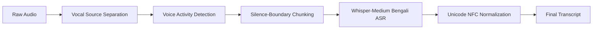
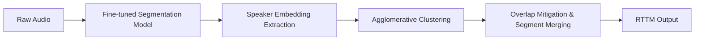

<div align="center">

# BUET CSE Fest 2026 — DL Sprint 4.0

### Bengali Long-Form Speech Recognition & Speaker Diarization

**Team Envisage** | [BUET CSE Fest 2026](https://www.facebook.com/people/BUET-CSE-Fest-2026/61586079370169/) | Kaggle Competition

[](https://opensource.org/licenses/MIT)
[](https://www.python.org/)
[](https://www.kaggle.com/)
[](https://pytorch.org/)
[](https://github.com/pyannote/pyannote-audio)

<br/>

| Competition | Task | Metric | Link |
|:---|:---|:---|:---|
| **DL Sprint 4.0 — Bengali Long-Form Speech Recognition** | ASR | Word Error Rate (WER) | [Kaggle ↗](https://www.kaggle.com/competitions/dl-sprint-4-0-bengali-long-form-speech-recognition) |
| **DL Sprint 4.0 — Bengali Speaker Diarization** | Diarization | Diarization Error Rate (DER) | [Kaggle ↗](https://www.kaggle.com/competitions/dl-sprint-4-0-bengali-speaker-diarization-challenge) |

</div>

---

## Table of Contents

- [Overview](#-overview)
- [Competition Context](#-competition-context)
- [Repository Structure](#-repository-structure)
- [Task 1: Bengali Long-Form Speech Recognition](#-task-1-bengali-long-form-speech-recognition)
- [Task 2: Bengali Speaker Diarization](#-task-2-bengali-speaker-diarization)
- [Conference Paper](#-conference-paper)
- [Tech Stack](#-tech-stack)
- [Getting Started](#-getting-started)
- [Results](#-results)
- [Acknowledgements](#-acknowledgements)
- [Citation](#-citation)

---

##  Overview

This repository contains **Team Envisage's** complete submission to the **DL Sprint 4.0** competition, organized as part of [BUET CSE Fest 2026](https://www.facebook.com/people/BUET-CSE-Fest-2026/61586079370169/). The competition consisted of two challenging Bengali speech processing tracks:

1. **Bengali Long-Form ASR** — Transcribing long-duration Bengali audio (lectures, interviews, conversations) into accurate text.
2. **Bengali Speaker Diarization** — Answering "who spoke when?" by producing time-stamped speaker segments from multi-speaker Bengali audio.

> Bengali, despite being one of the most widely spoken languages globally, remains significantly underrepresented in long-form speech technology — making this both a technically demanding and socially impactful challenge.

---

## Competition Context

| Detail | Info |
|:---|:---|
| **Organizer** | AI@BUET — BUET CSE Fest 2026 |
| **Platform** | Kaggle |
| **Duration** | Jan 29, 2026 – Feb 21, 2026 |
| **Participants** | 718 Entrants · 321 Participants · 107 Teams · 1,464 Submissions |
| **Scoring** | `0.70 × Online Score + 0.30 × Offline Score` |

**Competition Phases:**
- **Phase I (Online):** Kaggle submission evaluated on Public/Private test sets
- **Phase II (Final):** Hidden test set + On-site presentation for top teams

---

## 📁 Repository Structure

```
BUET-CSE-Fest-2026/
│
├── 📂 Bengali Long-form Speech Recognition/
│   └── bengali-long-form-speech-recognition.ipynb    # ASR inference notebook
│
├── 📂 Bengali Speaker Diarization/
│   ├── bangla-diarizz.ipynb                          # Diarization inference notebook
│   ├── bengali-diarization-training.ipynb            # Segmentation model fine-tuning
│   ├── segmentation-3-0-finetuned-bangla-*.tar.gz    # Fine-tuned segmentation weights
│   └── wespeaker-voxceleb-resnet34-lm-*.tar.gz       # Speaker embedding model weights
│
├── 📂 BUET_Conference_paper/
│   └── Bangla Diarizz.pdf                            # IEEE-format research paper
│
├── BUET CSE FEST 2026.pptx                           # On-site presentation slides
├── DL_Sprint_4.0_Team_Envisage_Submission_Summary.pdf # Submission summary document
└── README.md
```

---

## Task 1: Bengali Long-Form Speech Recognition

### Problem

Given long-form Bengali audio recordings (40–87 min each), produce an accurate Bangla text transcript.

```
Audio Input: test_001.wav
        ↓
Model Output: আজ আমরা দীর্ঘ অডিও ট্রান্সক্রিপশন নিয়ে আলোচনা করব ...
```

### Pipeline



### Approach

| Stage | Technique | Details |
|:---|:---|:---|
| **Preprocessing** | Demucs (htdemucs) | Vocal source separation to isolate speech from background music/noise |
| **Segmentation** | Silero VAD | Voice Activity Detection for intelligent chunking at silence boundaries |
| **ASR Backbone** | Whisper-Medium (Bengali fine-tuned) | BengaliAI fine-tuned Whisper model via `WhisperForConditionalGeneration` |
| **Decoding** | Autoregressive | Max 256 generated tokens per window with tuned generation hyperparameters |
| **Post-processing** | Unicode NFC normalization | Removal of zero-width characters, whitespace cleanup, formatting standardization |

### Evaluation Metric

**Weighted Mean Word Error Rate (WER):**
- WER computed per instance
- Weighted by word count per sentence
- All text comparisons use **Unicode NFC normalization** for consistency

---

## Task 2: Bengali Speaker Diarization

### Problem

Given multi-speaker Bengali audio, predict time-stamped segments identifying **who spoke when**.

```
Audio Input: conversation.wav
        ↓
Model Output:
  [0.0  - 5.2 ]  → SPEAKER_1
  [5.3  - 12.8]  → SPEAKER_2
  [13.0 - 18.5]  → SPEAKER_1
  [18.6 - 25.0]  → SPEAKER_3
```

### Pipeline



### Approach

| Component | Model / Technique | Details |
|:---|:---|:---|
| **Segmentation** | `pyannote/segmentation-3.0` (fine-tuned) | Fine-tuned on the official competition dataset to capture Bengali conversational patterns |
| **Speaker Embeddings** | `wespeaker-voxceleb-resnet34-LM` | ResNet34-based speaker embedding model (6.6M params) trained on VoxCeleb |
| **Clustering** | Centroid-based Agglomerative Clustering | Groups speaker segments by embedding similarity |
| **Post-processing** | Overlap mitigation + Segment merging | Heuristic refinement of segment boundaries |

### Evaluation Metric

**Diarization Error Rate (DER):**

| Error Type | Description |
|:---|:---|
| **False Alarm (FA)** | Predicted speech where there was silence |
| **Missed Speech (MISS)** | Failed to detect actual speech |
| **Speaker Confusion (CONF)** | Correct speech detection, wrong speaker assigned |

> **Score** = `100 × (1 − DER)`, clipped to [0, 100]. Lower DER → Higher score.

Speaker IDs are automatically mapped via optimal assignment — label naming does not need to match ground truth.

### Inference Efficiency

Models were also scored on **Real-Time Factor (RTF)**:
- RTF = processing time / audio duration
- Participants ranked by average RTF (lower = better)
- Percentile-based scoring: 1st percentile → 100 pts

---

## Conference Paper

An **IEEE-format research paper** is included in the `BUET_Conference_paper/` directory, detailing our methodology, experimental design, and findings for the Bengali Speaker Diarization challenge. This was a required deliverable for the offline evaluation component.

> **Offline Score** = `0.20 × Presentation + 0.20 × Paper + 0.60 × Novelty`

---

##  Tech Stack

<div align="center">

| Category | Technologies |
|:---|:---|
| **Deep Learning** | PyTorch, Transformers (HuggingFace), pyannote.audio |
| **ASR** | OpenAI Whisper (Bengali fine-tuned), Silero VAD |
| **Diarization** | pyannote/segmentation-3.0, wespeaker-voxceleb-resnet34-LM |
| **Audio Processing** | Demucs, librosa, soundfile |
| **Compute** | Kaggle Notebooks (GPU P100 / T4 × 2) |
| **Language** | Python 3.10+ |

</div>

---

##  Getting Started

### Prerequisites

```bash
pip install torch torchaudio transformers pyannote.audio
pip install demucs silero-vad librosa soundfile
pip install onnxruntime pandas numpy
```

### Reproduce ASR Inference

1. Open `Bengali Long-form Speech Recognition/bengali-long-form-speech-recognition.ipynb` on Kaggle
2. Attach the competition dataset
3. Run all cells — outputs the submission CSV with Bengali transcripts

### Reproduce Diarization Inference

1. Open `Bengali Speaker Diarization/bangla-diarizz.ipynb` on Kaggle
2. Attach the competition dataset and model weight files:
   - `segmentation-3-0-finetuned-bangla-pytorch-default-v1.tar.gz`
   - `wespeaker-voxceleb-resnet34-lm-pytorch-default-v1.tar.gz`
3. Run all cells — outputs RTTM-format speaker segments

### Fine-tune the Segmentation Model

```
Bengali Speaker Diarization/bengali-diarization-training.ipynb
```

This notebook walks through fine-tuning `pyannote/segmentation-3.0` on the official Bengali competition dataset to better capture Bengali conversational patterns and speaker turn dynamics.

---

##  Results

> *Detailed scores and leaderboard rankings can be found in `DL_Sprint_4.0_Team_Envisage_Submission_Summary.pdf`.*

| Task | Metric | Description |
|:---|:---|:---|
| **ASR** | WER ↓ | Weighted Mean Word Error Rate (lower is better) |
| **Diarization** | DER ↓ | Diarization Error Rate (lower is better) |
| **Diarization** | RTF ↓ | Real-Time Factor for inference efficiency |

---

##  Acknowledgements

- **[AI@BUET](https://www.facebook.com/people/BUET-CSE-Fest-2026/61586079370169/)** — Competition organizers & BUET CSE Fest 2026 hosts
- **[pyannote.audio](https://github.com/pyannote/pyannote-audio)** — State-of-the-art speaker diarization toolkit by Hervé Bredin
- **[WeSpeaker](https://github.com/wenet-e2e/wespeaker)** — Speaker embedding model toolkit
- **[OpenAI Whisper](https://github.com/openai/whisper)** — Multilingual ASR foundation model
- **[BengaliAI](https://bengali.ai/)** — Bengali Whisper fine-tuning & community resources
- **[Bengali-Loop Benchmark](https://arxiv.org/abs/2602.14291)** — Community benchmarks for long-form Bangla ASR and speaker diarization

---

##  Citation

If you find this work useful, please cite the competitions:

```bibtex
@misc{dlsprint4-asr-2026,
  author    = {Abdullah Muhammed Amimul Ehsan and Istiak Ahmmed Rifti and
               HM Shadman Tabib and Anik Saha and Masnoon Muztahid and Shahriar Kabir},
  title     = {DL Sprint 4.0 | Bengali Long-form Speech Recognition},
  year      = {2026},
  publisher = {Kaggle},
  url       = {https://kaggle.com/competitions/dl-sprint-4-0-bengali-long-form-speech-recognition}
}

@misc{dlsprint4-diarization-2026,
  author    = {Abdullah Muhammed Amimul Ehsan and Istiak Ahmmed Rifti and
               HM Shadman Tabib and Anik Saha and Masnoon Muztahid and Shahriar Kabir},
  title     = {DL Sprint 4.0 | Bengali Speaker Diarization},
  year      = {2026},
  publisher = {Kaggle},
  url       = {https://kaggle.com/competitions/dl-sprint-4-0-bengali-speaker-diarization-challenge}
}
```

---

<div align="center">

**Built with by Team Envisage for BUET CSE Fest 2026**

</div>
